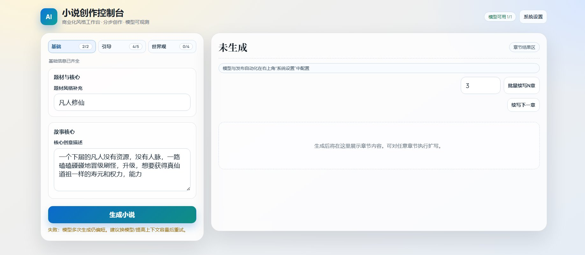

# AI Novel Generator

面向生产的中文小说生成 Web 应用（FastAPI + 可切换 LLM Provider）。



## 本次更新（2026-02）
- 新增系统设置中心：模型管理、番茄看板、CDP 发布自动化集中管理
- 新增 Fanqie CDP 能力：连通性检测、立即发布、定时队列、失败重试
- 新增质量审查：敏感词检测、可读性/连贯性评分、章节钩子检查、标题去重
- 新增章节工程化能力：分页、目录导航、默认收起、继续续写、批量续写
- 新增版本安全能力：章节回滚（内容修改前自动快照）
- 新增多 Provider：OpenRouter / NewAPI / Google 官方 / Claude 官方
- 修复多处稳定性问题：ASGI 空响应、非 JSON 错误返回、上游空内容诊断
- UI 重构：更专业化布局与交互反馈（生成过程动态进度）

## 模型使用建议（强烈推荐）
- 优先使用 `Claude 官方`、`Google 官方`、`OpenAI 系列模型`（可通过 NewAPI/OpenRouter 接入）
- 长篇正文生成优先选择大上下文模型（如 `claude-3-5-sonnet`、`gemini-1.5-pro`、`gpt-4.1/gpt-4o`）
- 若出现“内容过短/摘要化”，先切换更强模型，再降低单次目标章节量

## 功能
- 分步 5 问创作向导
- 章节生成与单章扩写
- Provider 切换：OpenRouter / NewAPI(OpenAI 兼容) / Google 官方 / Claude 官方(Anthropic)
- 模型连通性检测
- 基础生产能力：限流、并发保护、健康检查、安全响应头、请求追踪

## 快速启动
1. 安装依赖
```bash
pip install -r requirements.txt
```

2. 配置环境变量
```bash
copy .env.example .env
```
至少配置一组可用模型：
- OpenRouter：`OPENROUTER_API_KEY`
- 或 NewAPI：`NEWAPI_BASE_URL` + `NEWAPI_API_KEY` + `NEWAPI_MODELS`
- 或 Google 官方：`GOOGLE_API_KEY` + `GOOGLE_MODELS`
- 或 Claude 官方：`ANTHROPIC_API_KEY` + `ANTHROPIC_MODELS`

3. 启动
```bash
python app.py
```
访问：`http://localhost:8000`

## 关键接口
- `GET /healthz` 存活检查
- `GET /readyz` 就绪检查
- `GET /models` 可用模型列表
- `GET /models/health` 模型可用性检测
- `GET /workflow/questions` 5问模板
- `POST /generate` 生成/扩写

## 生产配置建议
- 设置 `SERVICE_API_KEY`，并通过 `x-api-key` 访问敏感接口
- 设置 `CORS_ORIGINS` 为你的前端域名，不要在生产使用 `*`
- 按上游限额调小 `MAX_GENERATE_CONCURRENCY` 和 `RATE_LIMIT_PER_MINUTE`
- 生产部署建议使用反向代理（Nginx/Caddy）和 HTTPS

## NewAPI 示例
```env
NEWAPI_BASE_URL=https://your-newapi-domain/v1
NEWAPI_API_KEY=sk-xxx
NEWAPI_MODELS=gpt-4o-mini,deepseek-chat
```

## Google 官方示例
```env
GOOGLE_API_KEY=AIzaSy...
GOOGLE_MODELS=gemini-1.5-flash,gemini-1.5-pro
# 可选，默认 https://generativelanguage.googleapis.com/v1beta
GOOGLE_API_BASE=https://generativelanguage.googleapis.com/v1beta
```

## Claude 官方示例
```env
ANTHROPIC_API_KEY=sk-ant-...
ANTHROPIC_MODELS=claude-3-5-sonnet-20241022,claude-3-5-haiku-20241022
# 可选，默认 https://api.anthropic.com/v1
ANTHROPIC_API_BASE=https://api.anthropic.com/v1
```

## 免责声明
请确保生成内容符合当地法律法规与平台政策。
